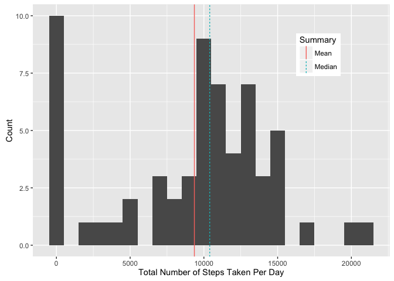
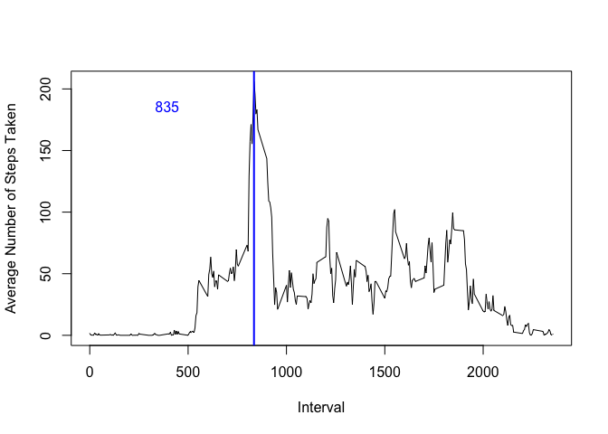
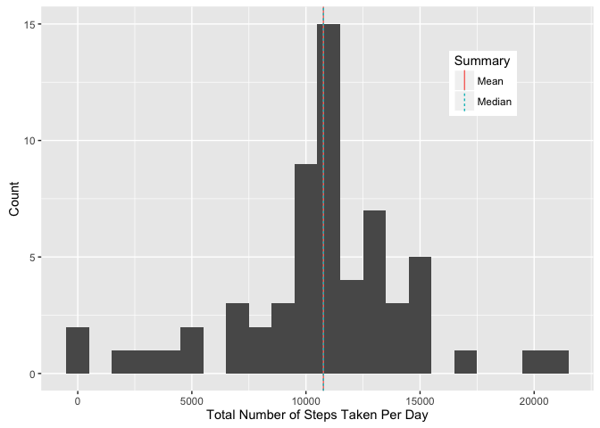
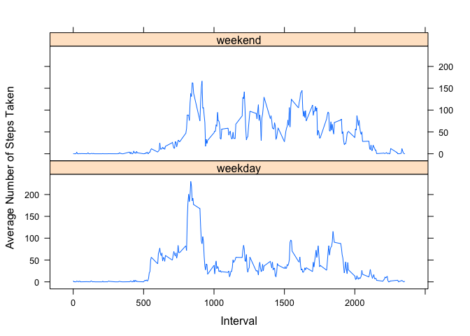

# Reproducible Research: Peer Assessment 1

For this assignment, I developed a code ("analysis.R") that analyzes data from a personal activity monitor, which measured the number of steps taken by an anonymous individual during daily time internals from October 1 to November 30, 2012. For my analysis, I compute sums, means, and medians of the number of steps taken per day and time interval. I complement my numerical results with plots, such as histograms and line plots. I will now present my code and interweave my analysis of the data.

The following files can be found in my GitHub repository:

1. Zip file containing data set and data set itself ("activity.zip" and "activity.csv")
2. "doc", "instruction_fig" folders and "README.md" from rdpeng
3. The report, "PA1_template.Rmd"
4. The figures
  + "total_steps_day.png"
  + "time_series_plot.png"
  + "total_steps_day_imputed.png"
  + "time_series_plot_weekend_weekday.png"
5. knitr information (for nice, viewable forms of the report see the files)
  + "rsconnect" and "PA1_template_files" folders
  + "PA1_template.html" and "PA1_template.md"

## Loading and preprocessing the data

I load the data by downloading the file, unzipping it, and reading it into a data frame.

```r
download.file(url = "https://d396qusza40orc.cloudfront.net/repdata%2Fdata%2Factivity.zip", 
              destfile = "activity.zip")
unzip(zipfile = "activity.zip")
activity <- read.csv(file = "activity.csv")
```

## What is mean total number of steps taken per day?

I calculate the total number of steps taken per day using the aggregate function and assign names for the column headers of my new data frame "total_steps_day."

```r
total_steps_day <- aggregate(x = activity$steps, by = list(activity$date), FUN = sum, na.rm = TRUE)
names(total_steps_day) <- c("Date", "TotalSteps")
```

Then, I compute the mean and median, which are 9354.22950819672 and 10395 steps respectively.

```r
mean_total_steps_day <- mean(x = total_steps_day$TotalSteps)
median_total_steps_day <- median(x = total_steps_day$TotalSteps)
cuts1 <- data.frame(Summary = "Mean", vals = mean_total_steps_day)
cuts2 <- data.frame(Summary = "Median", vals = median_total_steps_day)
cuts <- rbind(cuts1, cuts2)
```
The data frame "cuts" is used to assign colors for the mean and median lines in the historgram.

I plot the histogram using the ggplot2 package.

```r
library(ggplot2)
ggplot(data = total_steps_day, mapping = aes(total_steps_day$TotalSteps))+geom_histogram(binwidth = 1000)+
  labs(x="Total Number of Steps Taken Per Day", y="Count")+
  geom_vline(data=cuts, aes(xintercept=vals, linetype=Summary, colour = Summary), show.legend = TRUE)+
  theme(legend.position=c(0.8, 0.8))
```



geom_vline plots a vertical line for both the mean and median, colored according to the data frame "cuts," and theme plots the legend. The histrogram is saved as "total_steps_day.png". It shows a peak centered near the mean and median at about 10,000 total steps per day. There is, however, an anomalous peak at 0 total steps per day, likely due to the presence of NA values in the original data set.

## What is the average daily activity pattern?

Next, I analyzed the average number of steps per interval averaged over all the days of the study. I perform the averaging using the aggregate function and assign names for the column headers of my new data frame "average_steps_interval."

```r
average_steps_interval <- aggregate(x = activity$steps, by = list(activity$interval), FUN = mean, na.rm = TRUE)
names(average_steps_interval) <- c("Interval", "MeanSteps")
```

The 5-minute inteval that contains the most steps on average is 835. Below, I show the code for this computation.

```r
max_steps_interval = average_steps_interval$Interval[average_steps_interval$MeanSteps == 
                                                        max(average_steps_interval$MeanSteps)]
```
Between the bracket is a logical argument, which is satisfied only if the average number of steps for a given interal is equal to the maximum average number of steps in the whole data frame. The interval number for this average number of steps is extracted and saved to max_steps_interval.

I made the time series plot using the base plotting system.

```r
with(data = average_steps_interval, expr = plot(x = Interval, y = MeanSteps, type = "l", 
                                                ylab = "Average Number of Steps Taken"))
abline(v = max_steps_interval, col = "blue", lwd = 2)
legend(x = 200, y = 200, legend = max_steps_interval, bty = "n", text.col = "blue")
```



First, I turn on the png graphical device. Then, I use the with function to load the average_steps_interval data and line plot it as the interval vs. average number of steps. I draw a vertical line corresponding the interval with the maximum average number of steps and legend for this line. Finally, I turn reload the original graphical device. The time series plot is saved as "time_series_plot.png". It shows several peaks over the course of the day with the largest one occuring at interval 835. On average, very few steps are taken from intervals 0 to 500, suggesting that this is when the subject was sleeping. Therefore, the peak at 835 may correspond to the subjects commute to work.

## Imputing missing values

The number of missing values for the steps variable is 2304. I obtain this result by summing over the is.na function with the steps variable of the activity data frame as an argument, i.e.

```r
number_missing_values <- sum(is.na(activity$steps))
```

I chose to impute missing steps values in the data frame by using the mean for that 5 minute interval, averaged over all the days.

```r
for (i in 1:nrow(activity)) {
  if (is.na(activity$steps[i]) == TRUE) {
    interval_temp = activity$interval[i]
    mean_steps <- average_steps_interval$MeanSteps[average_steps_interval$Interval == interval_temp]
    activity$steps[i] <- mean_steps
  }
}
```

The for loop runs through each row of the steps column and first determines if it contains an NA value. If so, the interval is saved in a temporary variable, which is used to get the average number of steps in that interval from the average_steps_interval data frame. The missing value is then reassigned to the mean.

Using the same exact routine as the first section ("What is mean total number of steps taken per day?"), I calculate the total number of steps taken per day.

```r
total_steps_day_imputed <- aggregate(x = activity$steps, by = list(activity$date), FUN = sum, na.rm = TRUE)
names(total_steps_day_imputed) <- c("Date", "TotalSteps")
```

Then, I compute the mean and median, which are both 10766.1886792453 steps.

```r
mean_total_steps_day_imputed <- mean(x = total_steps_day_imputed$TotalSteps)
median_total_steps_day_imputed <- median(x = total_steps_day_imputed$TotalSteps)
cuts1_imputed <- data.frame(Summary = "Mean", vals = mean_total_steps_day_imputed)
cuts2_imputed <- data.frame(Summary = "Median", vals = median_total_steps_day_imputed)
cuts_imputed <- rbind(cuts1_imputed, cuts2_imputed)
```

Finally, I plot the histogram.

```r
ggplot(data = total_steps_day_imputed, mapping = aes(total_steps_day_imputed$TotalSteps))+
  geom_histogram(binwidth = 1000)+
  labs(x="Total Number of Steps Taken Per Day", y="Count")+
  geom_vline(data=cuts_imputed, aes(xintercept=vals, linetype=Summary, colour = Summary), show.legend = TRUE)+
  theme(legend.position=c(0.8, 0.8))
```



The overall shape of the histrogram more closely resembles a normal distribution than the earlier one. Additionally, both the mean and median shift to comparably higher values thus highlighting the importance of imputing the missing values. The number of days where 0 total steps were taken has reduced from 10 to 2. This is still quite suprising as our subject apparently spent two full days not walking at least one step! It may also be the case that there was either some malfunctioning in the device or that the subject was not fully acquainted with how to use it yet.

## Are there differences in activity patterns between weekdays and weekends?

Using the data frame from the previous section, I defined a new variable based on the date, which distinguishes between weekdays and weekends.

```r
library(lubridate)
activity$wday[wday(activity$date) >= 2 & wday(activity$date) <= 6] <- "weekday"
activity$wday[wday(activity$date) == 1 | wday(activity$date) == 7] <- "weekend"
```
For this I use the lubridate package, which has the wday function for converting ymd dates into a number corresponding to the weekday (1 - Sunday, ..., 7 - Saturday).

I now investigate the differences in activity patterns between weekdays and weekends. First, I calculate the average number of steps per inteval averaged over all days. Note that I use the data frame with imputed missing values.

```r
average_steps_interval_wday <- aggregate(x = activity$steps, by = list(activity$interval, activity$wday), 
                                          FUN = mean, na.rm = TRUE)
names(average_steps_interval_wday) <- c("Interval", "wday", "MeanSteps")
```

I made the time series plot using the lattice plotting system.

```r
library(lattice)
panel_plot <- xyplot(MeanSteps ~ Interval | wday, data = average_steps_interval_wday, type = "l", 
                      ylab = "Average Number of Steps Taken", layout = c(1,2))
print(panel_plot)
```



On weekdays, there are peaks in the average number of steps occuring at different intevals. This may correspond to the subjects commute to and from work, getting lunch, working out, etc. On weekends, however, the distribution is much more broadband, i.e. the subject walks more frequently. The onset of steps for the weekend is shifted to the right compared to the weekend, which is consistent with the notion that people wake up later on weekends than weekdays.
